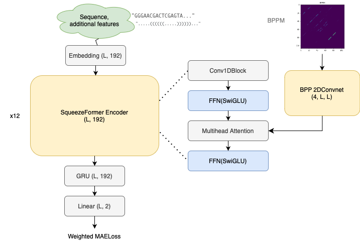

## Stanford - Ribonanza RNA Folding 2nd place solution

2nd-place solution to the [Stanford - Ribonanza RNA Folding competition](https://www.kaggle.com/competitions/stanford-ribonanza-rna-folding) on kaggle. 

see https://www.kaggle.com/competitions/stanford-ribonanza-rna-folding/discussion/460316 for more details.

**Keypoints:**

- Squeezeformer[1] + GRU head.
- Simple Conv2DNet for bpp, adding it as a bias to the attention matrix.
- AliBi positional encoding[2] for robust generalization on longer sequences.
- Weighted loss with signal_to_noise, with longer epochs.
- Additional features for minor score improvements.

**Features:**

I used some features found useful in the OpenVaccine Challenge, to help fast initial convergence. These included:

- CapR looptype.
- eternafold mfe.
- predicted Looptype with eternafold mfe.
- bpp features (sum, nzero, max).

The most crucial part of my solution is how to utilize the bpp matrix. I applied a simple shallow Conv2DNet to bpp and directly added it to the attention matrix.



## Hardware requirements
I used single RTX 4090 GPU but the code supports multi-GPU(DDP) training. You can set num_processes=num_gpus in the scripts(and see class CFG in train.py for the configurations requirements for DDP). Note that you should divide the train_batch_size by num_gpus to gaurantee the reproducibility.

At least 64GB of system memory(RAM) is recommended to avoid OOM.

At least 24GB of VRAM needed to guarantee the reproducibility if you use single GPU. Consider lowering train_batch_size, valid_batch_size and lr in this case. 

training(5xfold + 4xseed) takes over 120 hours with 1xRTX4090. 


## How to reproduce the solution
1. install required packages.
```
git clone https://github.com/hoyso48/Stanford---Ribonanza-RNA-Folding-2nd-place-solution
cd Stanford---Ribonanza-RNA-Folding-2nd-place-solution
pip install -r requirements.txt
```
2. download competition dataset.

If you have set up [kaggle-api](https://github.com/Kaggle/kaggle-api), use following commands.
```
mkdir datamount
kaggle competitions download -c stanford-ribonanza-rna-folding -p ./datamount
unzip ./datamount/stanford-ribonanza-rna-folding.zip 
```
Or manually download the data https://www.kaggle.com/competitions/stanford-ribonanza-rna-folding/data in the folder './datamount' and unzip it.

3. prepare preprocessed dataset including additional features.

If you have set up [kaggle-api](https://github.com/Kaggle/kaggle-api), use following commands.
```
kaggle datasets download -d hoyso48/stanford-ribonanza-rna-folding-dataset
unzip stanford-ribonanza-rna-folding-dataset.zip 
```

Or manually download  the data https://www.kaggle.com/datasets/hoyso48/stanford-ribonanza-rna-folding-dataset and unzip it.
And you can get all the model weights in the folder 'model_ckpts' that can be generated by the script 'run_all.sh'

Or you can follow notebooks in the folder 'prepare_data' to generate additional features yourself.

4. training / inference to generate submission.parquet.
```
chmod +x ./scripts/run_5fold_snfilter1_ep60.sh #(optional)5fold training, to check validation score with minimal config.
chmod +x ./scripts/run_4seed_snfilter0_ep200.sh #4x seed training using all training data
chmod +x ./scripts/run_make_submission.sh #inference and generate submission file
chmod +x ./scripts/run_all.sh #run all above
./scripts/run_all.sh
```

5. (Optional) submit to kaggle.
```
kaggle competitions submit -c stanford-ribonanza-rna-folding -f ./outputs/submission.parquet -m "Message"
```
## References
[1]Sehoon Kim, Amir Gholami, Albert Shaw, Nicholas Lee, Karttikeya Mangalam, Jitendra Malik, Michael W. Mahoney, and Kurt Keutzer. 2022. Squeezeformer: An Efficient Transformer for Automatic Speech Recognition. arXiv:2206.00888 [eess.AS]. [https://doi.org/10.48550/arXiv.2206.00888](url)

[2]Ofir Press, Noah A. Smith, Mike Lewis. 2022. Train Short, Test Long: Attention with Linear Biases Enables Input Length Extrapolation. arXiv:2108.12409 [cs.CL]. [https://doi.org/10.48550/arXiv.2108.12409](url)
